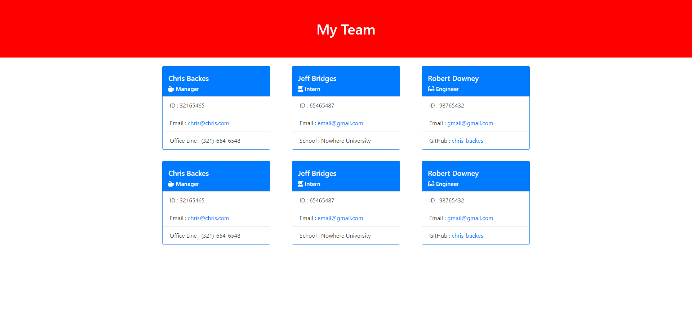

# Team Profile Generator

URL: https://github.com/chris-backes/team-profile-generator

## Description
The application creates an HTML file from user inputs on the command line. The HTML file is a page displaying employee information and has three types of employees: managers, engineers, and interns.

### Written with:
- Javascript
    - Node
        - Jest
        - Inquirer
- HTML
- CSS

## Table of Contents
* [Installation](#installation)
* [Usage](#usage)
* [Image of application](#png-of-application)
* [Credits](#credits)
* [License](#license)
* [Contributing](#contributing)
* [Questions](#questions)

## Installation
The file can be downloaded from its github repository. The application has two dependencies. Inquirer is used in production and jest is used in development. Both can be installed from the command line with the command `npm install` from the directory of the application of this application.

## Usage
The application is run form the command line using the command `node index` from the directory of the application. The user with be prompted with questions to answer. Once completed, the user will have an HTML and a CSS file in the dist/ folder.

### Tutorial Video
https://youtu.be/rSZh-uMTaKw

## Image of Application

## License
https://unlicense.org/

## Contributing
There are no plans to develop this application further. Contributions are not asked for.

## Questions
If you would like to reach out to me with any questions, you can find me here:
* Github: https://github.com/chris-backes
* Email: christopher.backes@gmail.com